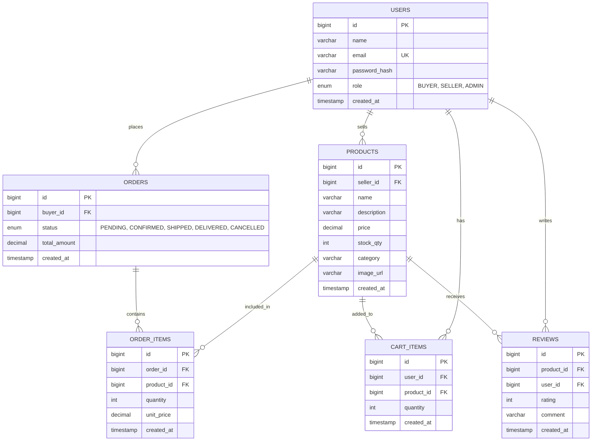
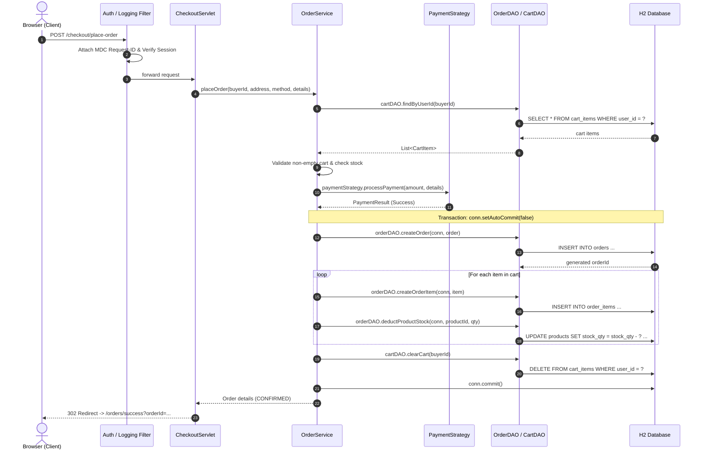

# PraveenMart — Multi-Seller E-Commerce Marketplace

**Java Servlets · JDBC · Apache Tomcat**  
**Architecture**: Enterprise Layered MVC · **Package**: `com.praveen.praveenmart`

---

## 1. Problem Statement & Project Overview

**PraveenMart** is an enterprise-grade multi-seller e-commerce marketplace web application. It connects independent merchants and buyers within a unified, responsive platform:
- **Sellers** can manage product listings (create, edit, delete with category, price, stock, and imagery), track incoming purchase orders, and monitor sales metrics.
- **Buyers** can explore catalog items, filter by category, perform keyword searches, maintain a cart, place orders via mock payment strategies, and submit star reviews.
- **Admins** manage registered users, monitor platform-wide sales volume and revenue, and moderate product listings.

---

## 2. Technology Stack Specification

| Component | Specification | Description |
| :--- | :--- | :--- |
| **JDK** | Java 17 (LTS) | Core Java runtime |
| **Servlet Container** | Tomcat 9.0.x | Servlet API `javax.servlet.*` |
| **Build Tool** | Maven 3.8+ | Dependency management & lifecycle build |
| **Database** | H2 Database 2.3.x | Embedded mode for testing; Server mode for deployment |
| **Connection Pool** | HikariCP | Initialized via `AppContextListener` on startup |
| **View Layer** | JSP + JSTL + Vanilla JS | Responsive UI with Material tokens & AJAX `fetch()` |
| **JSON Serialization** | Gson | Versioned API request/response serialization |
| **Password Hashing** | jBCrypt | Salted bcrypt (cost factor 12) for all credentials |
| **Testing** | JUnit 5 + Mockito | In-memory H2 DAO tests & mocked service tests |
| **Logging** | SLF4J + Logback | Structured logging with MDC Request ID tracking |
| **CI / CD** | GitHub Actions | Automated build & test on every push/PR |

---

## 3. Required Design Diagrams

### D1: Entity Relationship (ER) Diagram (Section 4 & 5)



---

### D2: Use Case Diagram (Section 1 & 5)

```mermaid
graph TD
    Buyer([Buyer])
    Seller([Seller])
    Admin([Admin])

    subgraph Authentication & Profile
        UC1[Register & Login]
        UC2[View Profile & Dashboard]
    end

    subgraph Buyer Actions
        UC3[Browse & Search Catalog]
        UC4[Manage Shopping Cart]
        UC6[Mock Checkout & Payment]
        UC7[View Order History]
        UC8[Submit Product Review]
    end

    subgraph Seller Actions
        UC10[List New Product]
        UC11[Edit & Delete Listings]
        UC12[View Incoming Orders]
        UC13[Update Order Status]
        UC14[View Sales & Revenue Analytics]
    end

    subgraph Admin Actions
        UC15[View All Platform Users]
        UC16[Moderate & Delete Listings]
        UC17[View Platform-wide Orders & Revenue]
        UC18[Remove Abusive User Accounts]
    end

    Buyer --> UC1
    Buyer --> UC2
    Buyer --> UC3
    Buyer --> UC4
    Buyer --> UC6
    Buyer --> UC7
    Buyer --> UC8

    Seller --> UC1
    Seller --> UC2
    Seller --> UC10
    Seller --> UC11
    Seller --> UC12
    Seller --> UC13
    Seller --> UC14

    Admin --> UC1
    Admin --> UC15
    Admin --> UC16
    Admin --> UC17
    Admin --> UC18
```



---

### D3: Sequence Diagram — Place-Order Flow (Section 2 & 5)



---

## 4. Software Design Patterns Implemented (Section 12)

| Design Pattern | Implementation in PraveenMart |
| :--- | :--- |
| **DAO Pattern** | Data access abstraction separating JDBC persistence from business rules: `UserDAO`, `ProductDAO`, `OrderDAO`, `CartDAO`, `ReviewDAO`. |
| **Front Controller Pattern** | Centralized servlet routing with standard request filters (`LoggingFilter`, `EncodingFilter`, `AuthFilter`) and REST controllers. |
| **Singleton Pattern** | HikariCP Connection Pool lifecycle managed centrally by `AppContextListener` and `DBUtil`. |
| **Factory Pattern** | Instantiation of DAOs (`DAOFactory`) and payment channels (`PaymentStrategyFactory`). |
| **Strategy Pattern** | Swappable payment methods (`CreditCardPaymentStrategy`, `UPIPaymentStrategy`, `CashOnDeliveryPaymentStrategy`). |
| **Builder Pattern** | Construction of complex DTO responses: `OrderSummaryDTO.Builder`, `ProductResponseDTO.Builder`, and `UserResponseDTO.Builder`. |

---

## 5. REST API Specification (`/api/v1/...`)

All JSON API endpoints adhere to Section 13 standards with standard response envelopes:
```json
{ "success": true, "data": { ... }, "error": null }
{ "success": false, "data": null, "error": { "code": "VALIDATION_ERROR", "message": "..." } }
```

| Method | Endpoint | Description | Auth Required |
| :--- | :--- | :--- | :---: |
| `GET` | `/api/v1/health` | Service and database health connectivity check | No |
| `GET` | `/api/v1/products` | Browse catalog, keyword search, category filter | No |
| `GET` | `/api/v1/products/{id}` | Retrieve individual product details | No |
| `POST` | `/api/v1/products` | Create a new product listing | Seller / Admin |
| `DELETE` | `/api/v1/products?id={id}` | Delete product listing | Seller / Admin |
| `GET` | `/api/v1/cart` | View current user shopping cart | Yes |
| `POST` | `/api/v1/cart` | Add item or update quantity | Yes |
| `DELETE` | `/api/v1/cart?productId={id}`| Remove item or clear cart | Yes |
| `GET` | `/api/v1/orders` | View past orders (Buyer) or incoming orders (Seller) | Yes |
| `POST` | `/api/v1/orders` | Place order / checkout | Yes |
| `PUT` | `/api/v1/orders/status` | Update order workflow status | Seller / Admin |
| `GET` | `/api/v1/reviews?productId={id}`| Get reviews for product | No |
| `POST` | `/api/v1/reviews` | Submit product review & rating (1–5) | Yes |

---

## 6. Security Checklist Compliance (Section 9)

- [x] **100% Parameterized SQL Queries**: Strictly enforced via `PreparedStatement`. No raw SQL concatenation. Verified via `grep -rn "Statement)" src/`.
- [x] **BCrypt Password Hashing**: `PasswordUtil` uses salted BCrypt (cost factor 12). Plaintext passwords are never stored or logged.
- [x] **Session Fixation Defense**: `HttpSession` invalidated and regenerated upon successful login; 30-minute explicit session timeout configured in `web.xml`.
- [x] **XSS Output Sanitization**: HTML escaping across JSP templates and JSTL `<c:out>` formatting.
- [x] **Authentication & Role Authorization**: `AuthFilter` protects `/admin/*`, `/seller/*`, `/cart`, `/orders`, and `/api/v1/*` endpoints.
- [x] **Information Disclosure Defense**: Custom `web.xml` 404 and 500 error pages suppress server stack traces.
- [x] **Exclusion of Secrets**: Database credentials kept in `.env` / `config.properties`, strictly excluded via `.gitignore`.

---

## 7. Quickstart & Local Execution

### Prerequisites
- JDK 17 (LTS)
- Apache Maven 3.8+

### Setup & Run
```bash
# 1. Clone repository
git clone <repository-url>
cd praveenmart

# 2. Build & run tests
mvn clean verify

# 3. Start local server (Embedded Tomcat on port 8083)
cd PraveenMart
mvn clean compile exec:java
```

Open your browser at **`http://localhost:8083/`**.
