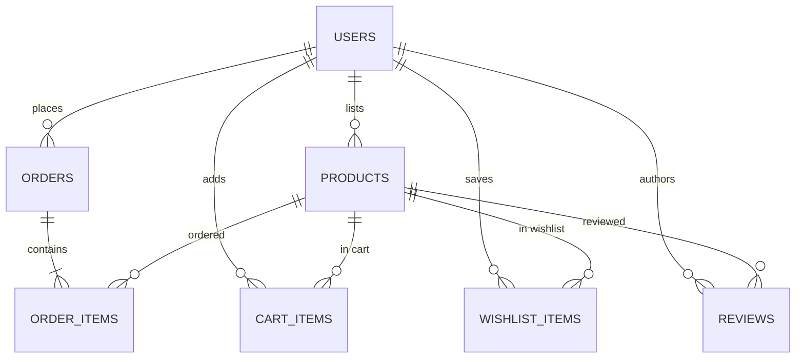

# PraveenMart — Multi-Seller E-Commerce Marketplace
> **Builder:** Solo Developer (Praveen)  
> **Status:** **Final Review Complete — Full Release `v1.2.0`**

---

## 1. Problem Statement
Modern digital retail requires a robust, responsive multi-seller platform where independent merchants can list and manage inventories while shoppers enjoy seamless product discovery, multi-item cart management, streamlined mock checkout, order tracking, and peer reviews. **PraveenMart** provides an end-to-end marketplace featuring role-based access control (Buyer, Seller, Admin), a serverless AI shopping assistant, and enterprise-grade security standards.

The application is engineered strictly using native Java Web standards (**Java Servlets 4.0, JDBC, HikariCP, and Apache Tomcat 9**), eliminating heavyweight framework bloat while showcasing solid software design patterns: **Front Controller**, **Layered MVC**, **DAO**, **Singleton**, **Factory**, **Strategy**, and **Builder**.

---

## 2. System Architecture

```
Browser (HTML5, Vanilla JS, AJAX fetch, Glassmorphism Widget)
  |  HTTP / REST JSON
  v
Filter Layer (AuthFilter, LoggingFilter with MDC, EncodingFilter)
  |
  +--> Front Controller / Servlets (ProductServlet, OrderServlet, CartServlet, WishlistServlet, ChatServlet)
  |      |
  |      v
  +--> Service Layer (ProductService, OrderService, UserService, CartService, WishlistService, ChatService)
         |
         +--> DAO Layer (ProductDAO, OrderDAO, UserDAO, ReviewDAO, CartDAO, WishlistDAO)
         |      | (100% PreparedStatements, Try-with-resources, Zero String Concatenation)
         |      v
         |    Connection Pool (HikariCP via AppContextListener)
         |      v
         |    H2 Database Engine (Server / Embedded Mode)
         |
         +--> AI Chatbot Subsystem (Strategy Pattern)
                |
                +--> ChatProvider Interface
                       |-- MockChatProvider (Offline FAQ & Domain Search)
                       `-- GeminiChatProvider (Google Gemini 1.5 Flash LLM)
```

---

## 3. Technology Stack Specification

| Component | Technology / Specification | Version | Purpose |
| :--- | :--- | :--- | :--- |
| **JDK** | OpenJDK 17 (LTS) | 17+ | Core runtime language environment |
| **Servlet Container** | Apache Tomcat | 9.0.x (`javax.servlet.*`) | Enterprise Servlet/JSP container |
| **Build Tool** | Apache Maven | 3.9+ | Dependency management, build lifecycle, CI execution |
| **Database** | H2 Database Engine | 2.3.x | Relational DB: Server mode for deployment, in-memory for testing |
| **Connection Pooling** | HikariCP | 2.7.9 | High-performance pooled connection management |
| **View Layer** | JSP + JSTL + Vanilla JS (`fetch`) | Standard | Server-rendered pages with AJAX-powered interactivity |
| **JSON Serialization** | Google Gson | 2.8.5 | High-speed JSON DTO serialization |
| **Password Hashing** | jBCrypt | 0.4 | BCrypt salted password hashing (12 rounds) |
| **Logging** | SLF4J + Logback | 1.7 / 1.2 | Structured logging with MDC request correlation |
| **Testing** | JUnit 5 + Mockito | 5.10 | DAO testing against `jdbc:h2:mem:test` and mocked service tests |
| **Static Analysis** | Checkstyle & SpotBugs | 3.3.1 / 4.8.3 | Automated code quality analysis in CI |
| **AI LLM API** | Google Gemini API (`gemini-1.5-flash`) | v1beta | Conversational shopping assistant with Mock fallback |
| **CI / CD** | GitHub Actions | Ubuntu Latest | Automated `mvn -B clean verify` on push and PR |

---

## 4. Required Design Diagrams (Section 5)

All three mandatory design diagrams are produced and checked into the repository:

| ID | Diagram Name | Description & Derivation | Diagram Files |
| :---: | :--- | :--- | :--- |
| **D1** | **ER Diagram** | All entities, relations, primary/foreign keys, and data types (Section 4) | [PlantUML](docs/diagrams/D1_er_diagram.puml) · [Mermaid in Report](FINAL_REPORT.md#2-entity-relationship-diagram-d1) |
| **D2** | **Use Case Diagram** | Actors (Buyer, Seller, Admin) and all marketplace use cases (Section 1) | [PlantUML](docs/diagrams/D2_use_case_diagram.puml) · [Checkpoint 1 Doc](docs/checkpoints/checkpoint1_problem_statement.md#3-use-case-diagram-d2) |
| **D3** | **Sequence Diagram** | The complete place-order flow: Browser ➔ Filter ➔ Servlet ➔ Service ➔ DAO ➔ Database (Section 2) | [PlantUML](docs/diagrams/D3_sequence_diagram.puml) |

### D1: Entity-Relationship Diagram Preview


---

## 5. Feature Implementation Matrix

### Mandatory Features (F1 – F8)
- [x] **F1: User Authentication & Roles** — Registration & login for Buyer and Seller; pre-seeded Administrator (`admin@praveenmart.com`); BCrypt hashing.
- [x] **F2: Seller Product Management** — Create, edit, and delete product listings (name, description, price, stock, category, image URL).
- [x] **F3: Buyer Discovery** — Browse catalog, filter by category (Electronics, Fashion, Home & Kitchen, Accessories, Books), keyword search.
- [x] **F4: Shopping Cart** — Add items, update quantities, remove items, live subtotal computation.
- [x] **F5: Mock Checkout** — Atomic order placement and inventory reduction via mock payment confirmation (COD, Cards, UPI).
- [x] **F6: Order History & Tracking** — Buyer order history and status tracking; seller incoming line-item order view.
- [x] **F7: Platform Administration** — Total platform analytics, user moderation/removal, product listing moderation.
- [x] **F8: Product Reviews & Star Ratings** — Customer star ratings (1–5) and written feedback on catalog products.

### Optional & Advanced Features (O1 – O4)
- [x] **O1: Wishlist / Save-for-Later** — Save favorite items, "Save for Later" directly from cart, move from wishlist into cart.
- [x] **O2: Order Status Workflow** — Status transitions: `PENDING` ➔ `CONFIRMED` ➔ `SHIPPED` ➔ `DELIVERED`.
- [x] **O3: Seller Sales Dashboard** — Merchant order counts, listed product totals, gross revenue calculation.
- [x] **O4: AI Shopping Assistant** — Floating glassmorphism widget, `/api/v1/chat` backend proxy, Gemini 1.5 Flash LLM, rate limiter, session cache, graceful degradation.

---

## 6. Setup & Running Locally

### Prerequisites
- **JDK 17 LTS** installed (`java -version`)
- **Maven 3.8+** installed (`mvn -version`)

### Quick Start
```bash
# 1. Clone repository
git clone https://github.com/Yeah-itsPraveen/praveenmart.git
cd praveenmart

# 2. Configure environment (Optional - defaults to offline Mock chatbot & embedded H2)
cp .env.example .env

# 3. Compile, verify, and run tests
mvn clean verify

# 4. Start local development server
cd PraveenMart
mvn exec:java
# Or launch via Cargo:
mvn cargo:run
```
Open **[http://localhost:8083/](http://localhost:8083/)** in your web browser.

---

## 7. Pre-Seeded Accounts

| Role | Email | Password | Access Level |
| :--- | :--- | :--- | :--- |
| **Admin** | `admin@praveenmart.com` | `admin123` | Moderate listings, delete users, platform analytics |
| **Seller** | `seller@test.com` | `password` | List products, view incoming orders, update order status |
| **Buyer** | `buyer@test.com` | `password` | Browse, cart, wishlist, checkout, submit reviews |

---

## 8. Checkpoint Deliverables & Documentation Index

All required project reports, presentations, and guides are thoroughly documented:

- 📋 **[Final Engineering Report](FINAL_REPORT.md)** — In-depth architectural design, technical decisions, pattern analysis, and limitations.
- 🖼️ **[Checkpoint 1 Problem Statement & D2](docs/checkpoints/checkpoint1_problem_statement.md)** — Problem statement and use case diagram.
- 📊 **[MVP Review 2-Slide Summary](docs/checkpoints/mvp_review_slides.md)** — Executive problem statement and completed vs. planned roadmap.
- 🔒 **[Security Checklist & Audit Verification](docs/security_checklist.md)** — Section 9 compliance verification.
- 📽️ **[Slide Deck Presentation](docs/SLIDE_DECK.md)** — Complete Final Review presentation slides.
- 🎙️ **[Rehearsed Demo Script](docs/DEMO_SCRIPT.md)** — Minute-by-minute live presentation walkthrough.
- 📹 **[Backup Demo Video Guide](docs/BACKUP_DEMO_GUIDE.md)** — 2.5-minute video storyboard and fallback guide.
- 🧪 **[Manual Test-Case Sheet](docs/MANUAL_TEST_CASES.md)** — Comprehensive end-to-end test cases (TC-AUTH to TC-OBS).
- 🔄 **[Sprint Retrospectives](RETRO.md)** — 5 sprint retrospectives following the 2-week agile cycle.
- 🤝 **[Contributing Guide](CONTRIBUTING.md)** — Step-by-step developer contribution guidelines.
- 🏷️ **[Changelog](CHANGELOG.md)** — Semantic version history (`v0.1.0` ➔ `v1.0.0` ➔ `v1.1.0` ➔ `v1.2.0`).

---

## 9. Observability & Health Check
Liveness endpoint conforming to Section 18:
```bash
curl http://localhost:8083/api/v1/health
```
Response:
```json
{
  "status": "UP",
  "db": "UP"
}
```

---

## 10. Version Control & CI Compliance
- **Commit History:** Maintained with Conventional Commits (`feat:`, `fix:`, `test:`, `docs:`) across the checkpoint window.
- **CI Pipeline:** Automated build and test on GitHub Actions ([`.github/workflows/build.yml`](.github/workflows/build.yml)).
- **Release Tags:** `v0.1.0`, `v1.0.0`, `v1.1.0`, `v1.2.0`.
