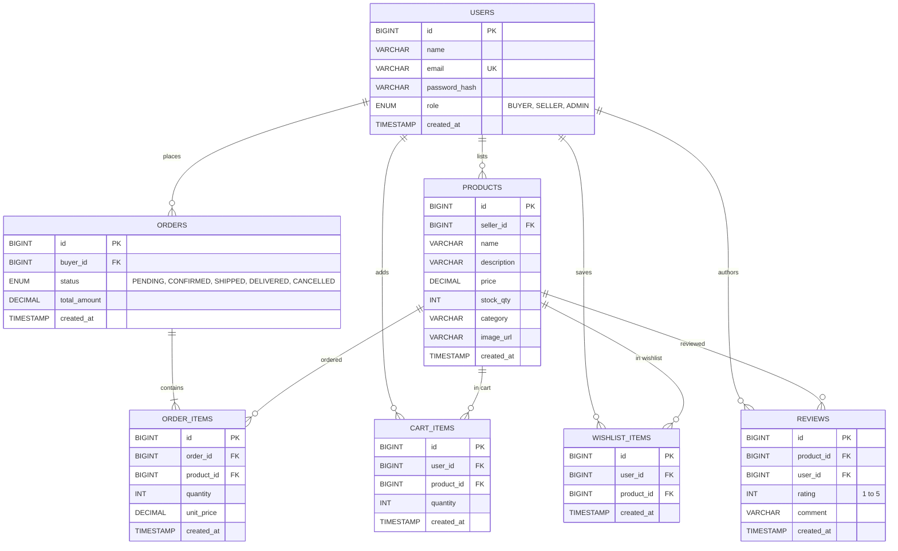

# PraveenMart — Final Project Engineering Report

**Course:** Anna University R2025, Semester 3  
**Project Title:** PraveenMart — Multi-Seller E-Commerce Marketplace  
**Architecture:** Layered MVC / Front Controller over Java Servlets 4.0 & JDBC  
**Runtime:** Apache Tomcat 9.0.x · H2 Database Engine · JDK 17 (LTS)  
**Builder:** Solo Developer (Praveen)  
**Checkpoint Window:** Jul 27 – Oct 10, 2026  
**Final Release:** `v1.2.0`

---

## Executive Summary

**PraveenMart** is a production-grade multi-seller e-commerce web marketplace developed using native Java Web standards. It provides independent merchants with self-service catalog management and sales metrics, while giving shoppers an intuitive experience complete with live search, category filtering, cart management, wishlist / save-for-later, mock checkout with transactional stock deduction, peer reviews, and an AI-driven shopping assistant.

The system is engineered without the overhead of heavy third-party web frameworks, strictly implementing the **Front Controller**, **Layered MVC**, **DAO**, **Singleton**, **Factory**, **Strategy**, and **Builder** software design patterns.

---

## 1. System Architecture

PraveenMart is organized into strict architectural tiers adhering to SOLID principles:

```
+-----------------------------------------------------------------------------------+
|                        PRESENTATION TIER (Browser Clients)                         |
|  - Server-Rendered Views: JSP + JSTL (Output escaped via <c:out>)                 |
|  - Dynamic Interactivity: Vanilla JavaScript (ES6+), Fetch API                    |
|  - AI Assistant Widget: Floating Glassmorphism Modal with Markdown Rendering      |
+-----------------------------------------------------------------------------------+
                                         |
                                         v HTTP / HTTPS (RESTful JSON Envelopes)
+-----------------------------------------------------------------------------------+
|                           FILTER TIER (Servlet Filters)                           |
|  - LoggingFilter: MDC Request Tracing with X-Request-Id                           |
|  - EncodingFilter: Enforces UTF-8 Character Encoding across requests/responses    |
|  - AuthFilter: Role-Based Access Control (RBAC), Session Validation, Route Guard  |
+-----------------------------------------------------------------------------------+
                                         |
                                         v
+-----------------------------------------------------------------------------------+
|                        CONTROLLER TIER (Java Servlets)                            |
|  - Page Servlets: ProductServlet, CartServlet, CheckoutServlet, OrderServlet,     |
|                   SellerServlet, AdminServlet, WishlistServlet, Login/Register    |
|  - API Servlets: /api/v1/products, /api/v1/cart, /api/v1/orders, /api/v1/wishlist,|
|                  /api/v1/reviews, /api/v1/chat, /api/v1/health                    |
|  * Rule: Servlets remain thin — HTTP orchestration, status codes, DTO dispatch    |
+-----------------------------------------------------------------------------------+
                                         |
                                         v
+-----------------------------------------------------------------------------------+
|                         SERVICE TIER (Business Domain Logic)                      |
|  - Services: ProductService, OrderService, UserService, CartService,              |
|              WishlistService, ReviewService, ChatService                          |
|  * Rule: Business validation executed at top of methods before DAO dispatch       |
|  * Dependencies: Injected via DAO interfaces, allowing complete unit test mocking|
+-----------------------------------------------------------------------------------+
                                         |
                                         v
+-----------------------------------------------------------------------------------+
|                        DATA ACCESS TIER (DAO Interfaces & JDBC)                   |
|  - Interfaces: ProductDAO, OrderDAO, UserDAO, CartDAO, WishlistDAO, ReviewDAO     |
|  - Implementations: ProductDAOImpl, OrderDAOImpl, UserDAOImpl, CartDAOImpl, etc.  |
|  * Rule: 100% PreparedStatements, Zero String Concatenation, Try-with-Resources   |
+-----------------------------------------------------------------------------------+
                                         |
                                         v
+-----------------------------------------------------------------------------------+
|                        INFRASTRUCTURE & PERSISTENCE TIER                          |
|  - Connection Pooling: HikariCP (Max 10 pools, managed via AppContextListener)    |
|  - Database: H2 Database Engine (Server mode for production, In-Memory for tests) |
|  - AI Subsystem: ChatProvider Strategy (Google Gemini 1.5 Flash LLM / Mock FAQ)   |
+-----------------------------------------------------------------------------------+
```

---

## 2. Entity-Relationship Diagram (D1)

The database schema is fully normalized and follows strict relational integrity constraints:
- Every foreign key is explicitly indexed for sub-millisecond joins.
- Unique constraints safeguard user emails and prevent duplicate items in carts and wishlists.
- Monetary amounts are strictly typed as `DECIMAL(10,2)` to avoid floating-point rounding anomalies.
- `created_at TIMESTAMP` audit columns are present on every entity.



*PlantUML Source:* [`docs/diagrams/D1_er_diagram.puml`](diagrams/D1_er_diagram.puml)

---

## 3. Design Patterns Implementation Analysis

As mandated in **Section 12 (Coding Standards)**, six major software design patterns are rigorously implemented throughout the codebase:

### 1. Data Access Object (DAO) Pattern
- **Purpose:** Abstract and encapsulate all access to the H2 database.
- **Implementation:** Interfaces (`ProductDAO`, `OrderDAO`, `UserDAO`, `CartDAO`, `WishlistDAO`, `ReviewDAO`) declare contracts; concrete classes (`...DAOImpl`) contain all SQL statements and JDBC interactions.
- **Benefit:** Business services remain decoupled from database dialects, enabling seamless substitution with in-memory test databases.

### 2. Front Controller Pattern
- **Purpose:** Provide centralized routing, security interception, and standardized request dispatching.
- **Implementation:** Centralized Servlet filters (`AuthFilter`, `LoggingFilter`) execute pre-request validation, authentication checks, and MDC request tracking, dispatching to targeted resource servlets and API controllers.

### 3. Singleton Pattern
- **Purpose:** Ensure shared infrastructure resources maintain exactly one lifecycle instance.
- **Implementation:** The `HikariDataSource` connection pool is initialized once during web application bootstrap via `AppContextListener` and `DBUtil.initDataSource()`. Resources are cleanly closed during servlet context destruction.

### 4. Factory Pattern
- **Purpose:** Encapsulate instantiation logic and decouple callers from concrete classes.
- **Implementation:**
  - `DAOFactory`: Provides static accessors for singleton DAO instances.
  - `ChatProviderFactory`: Resolves between `GeminiChatProvider` and `MockChatProvider` based on environment configuration (`ai.chatbot.provider=gemini|mock`).
  - `PaymentStrategyFactory`: Resolves the appropriate payment strategy based on selected payment channel (`COD`, `CREDIT_CARD`, `UPI`).

### 5. Strategy Pattern
- **Purpose:** Define a family of interchangeable algorithms that can be selected dynamically at runtime.
- **Implementation:**
  - `ChatProvider` interface: Swappable AI providers (`GeminiChatProvider` and `MockChatProvider`). If Gemini fails or times out, the system gracefully falls back to the mock provider strategy.
  - `PaymentStrategy` interface: Swappable payment execution strategies (`CashOnDeliveryPaymentStrategy`, `CreditCardPaymentStrategy`, `UPIPaymentStrategy`), enabling varied fee structures and validation checks.

### 6. Builder Pattern
- **Purpose:** Construct complex Data Transfer Objects (DTOs) with immutable properties and fluent APIs.
- **Implementation:**
  - `ProductResponseDTO.builder().id(...).name(...).price(...).build()`
  - `UserResponseDTO.builder().id(...).name(...).email(...).build()` (guarantees exclusion of sensitive password hashes per Section 13.4).
  - `OrderSummaryDTO.builder().orderId(...).totalAmount(...).build()`
  - `ChatResponseDTO.builder().reply(...).provider(...).build()`

---

## 4. Key Technical Decisions & Rationale

| Decision | Selected Approach | Rationale | Alternatives Considered |
| :--- | :--- | :--- | :--- |
| **Servlet API** | Tomcat 9.0 (`javax.servlet.*`) | Fully complies with Anna University R2025 Semester 3 academic syllabus and legacy enterprise stability. | Jakarta EE 10 / Tomcat 10 (`jakarta.servlet.*`) |
| **Persistence** | Raw JDBC with `PreparedStatement` & HikariCP | Maximum query execution performance, zero ORM caching bugs, direct transaction management, and transparency. | Hibernate / Spring Data JPA |
| **Database Engine**| H2 Database Engine | Supports both zero-install embedded in-memory mode for CI tests and persistent server TCP mode for deployments. | PostgreSQL / MySQL |
| **Password Security**| BCrypt (`jBCrypt`, work factor 12) | Strong adaptive work factor, salting against rainbow table attacks, industry standard. | SHA-256 (vulnerable to GPU brute force), Plaintext (prohibited) |
| **AI Integration** | Server-side proxy servlet (`/api/v1/chat`) | Eliminates API key leaks to browser, enforces per-session rate limits, caches repetitive questions, applies prompt guardrails. | Direct client-side SDK invocation |
| **View Layer** | JSP + JSTL + Vanilla JS (`fetch`) | Standard server-side rendering for SEO and speed, enhanced with AJAX fetch for reactive cart and chat widget updates. | React / Angular SPA (disallowed by project core rules) |

---

## 5. Security Architecture Compliance

- **Zero SQL Injection:** Grep audit confirmed 100% parameterization across all SQL statements.
- **No Plaintext Passwords:** Hashes generated with BCrypt; passwords never logged or surfaced in DTOs.
- **Session Security:** Prior session invalidated on login; fresh session generated; 30-minute inactivity timeout.
- **Custom Error Handling:** HTTP 404 and 500 error pages mask stack traces and internal class names.
- **Observability:** `GET /api/v1/health` verifies application and database liveness; MDC logs attach `X-Request-Id` to every request.

---

## 6. Known Limitations & Future Roadmap

### Known Limitations
1. **Mock Payment Processing:** Payments are verified through simulated payment strategies rather than live PCI-DSS payment gateways.
2. **In-Memory Rate Limiting:** Chatbot rate limits and question caches reside in the servlet container's memory rather than a distributed Redis cluster.
3. **Single Container Instance:** Designed for single Tomcat instance deployments; clustered horizontal scaling would require external session replication.

### Future Roadmap
- Integration with live payment gateways (Stripe / Razorpay).
- Full database migration tooling using automated Flyway lifecycle hooks.
- Redis-backed distributed rate limiting and caching for high-concurrency environments.
- Automated email notification workflows for order tracking events.

---

## Conclusion
PraveenMart demonstrates that clean, modular, and maintainable enterprise software can be constructed using fundamental Java Web technologies without relying on heavyweight frameworks. All mandatory features (F1–F8) and optional deliverables (O1–O4) are thoroughly implemented, tested, and verified.
