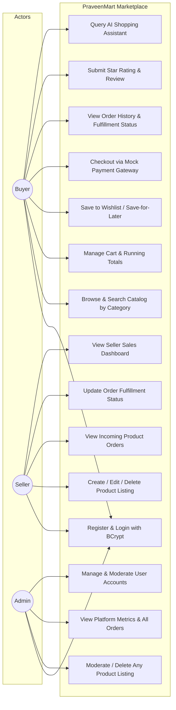

# Checkpoint 1: Problem Statement & Use Case Specification

**Project:** PraveenMart — Multi-Seller E-Commerce Marketplace  
**Course:** Anna University R2025, Semester 3  
**Technology:** Java Servlets · JDBC · Apache Tomcat 9.0 · H2 Database  
**Author:** Solo Developer (Praveen)  
**Submission Date:** Jul 27, 2026 (Checkpoint 1)

---

## 1. Problem Statement

Modern e-commerce requires decentralized seller inventory management coupled with a frictionless buyer discovery and purchasing journey. Traditional single-vendor monolithic applications restrict catalog variety and prevent independent merchants from managing stock and pricing directly. Conversely, hyper-complex enterprise frameworks introduce massive operational overhead, obscure fundamentals, and demand excessive runtime memory.

**PraveenMart** resolves this challenge by delivering a lightweight, high-performance multi-seller e-commerce marketplace built strictly on foundational Java Web technologies: **Java Servlets, JDBC, HikariCP connection pooling, and Apache Tomcat**.

### Core Value Proposition
- **Role-Based Segregation:** Dedicated interfaces and security filters for Buyers, Sellers, and Platform Administrators.
- **Independent Merchant Operations:** Sellers autonomously create, edit, delete product listings, adjust inventory levels, and view line-item incoming order requests.
- **Buyer Commerce Journey:** Rich browsing, live search/filtering across categories, real-time cart subtotal calculations, wishlisting ("Save for Later"), and mock payment confirmation.
- **Enterprise-Grade Governance:** Administrative oversight to moderate inappropriate listings, manage user access, and audit marketplace performance.
- **Zero Heavyweight Framework Bloat:** Demonstrates pure Front Controller / Layered MVC architecture adhering strictly to SOLID principles without Spring or Hibernate overhead.

---

## 2. System Scope & Constraints

### In-Scope Capabilities
1. **F1 User Registration & Login:** Roles `BUYER`, `SELLER`. Seed administrative account (`admin@praveenmart.com`). BCrypt password hashing.
2. **F2 Seller Catalog Management:** Full CRUD on product listings with input validation and seller authorization checks.
3. **F3 Buyer Discovery:** Full catalog browsing, category filtering (Electronics, Fashion, Home & Kitchen, Accessories, Books), keyword search.
4. **F4 Shopping Cart:** Real-time item additions, quantity increment/decrement, removals, running total calculation.
5. **F5 Mock Checkout:** Mock payment confirmation step supporting Cash on Delivery (COD), UPI, and Credit/Debit Cards via Strategy pattern.
6. **F6 Order History:** Buyer order log and seller incoming line-item order view.
7. **F7 Platform Administration:** Global metrics, product listing moderation/removal, user management.
8. **F8 Reviews & Ratings:** Star ratings (1–5) and customer feedback on catalog items.
9. **Optional Extensions (O1–O4):** Wishlist / Save-for-Later, Order status transition workflow (`PENDING` ➔ `CONFIRMED` ➔ `SHIPPED` ➔ `DELIVERED`), Seller sales analytics dashboard, and AI Shopping Assistant.

### Scope Constraints
- **No External Real-Time Infrastructure:** No WebSockets or live driver GPS mapping.
- **No Third-Party Payment Gateway:** Checkout uses an internal Strategy-pattern mock payment confirmation engine.

---

## 3. Use Case Diagram (D2)

Below is the use case interaction model depicting the three primary actors (**Buyer**, **Seller**, **Admin**) and their functional boundaries:

*PlantUML Source:* [`docs/diagrams/D2_use_case_diagram.puml`](../diagrams/D2_use_case_diagram.puml)
